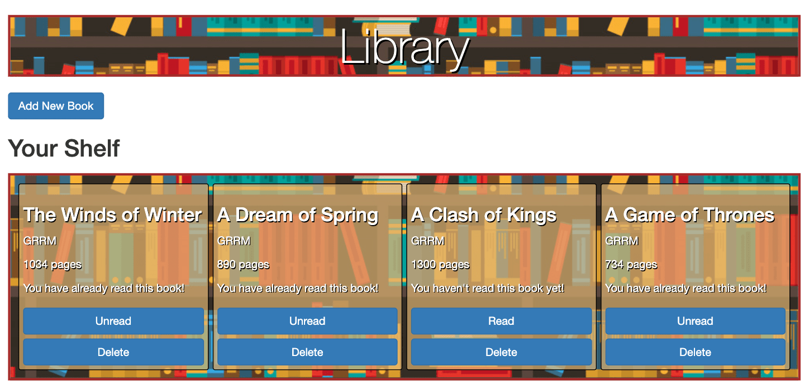

# Library

> A Javascript library app that allow users to add books with their titles, authors, number of pages, and indicator if the user has already read it or not. 



In this application you can create a library of books you would like to read

## Built With

- Javascript
- HTML
- CSS

## Live Demo

[Live Demo Link](https://js-library.netlify.app/)


## Getting Started

To get a local copy up and running follow these simple example steps.

```
git clone https://github.com/bettercallazamat/js-library.git
Open the index.html
Explore the website
```

## Authors

👤 **Azamat Nuriddinov**

- Github: [@bettercallazamat](https://github.com/bettercallazamat)
- Twitter: [@azamat_nuriddin](https://twitter.com/azamat_nuriddin)
- Linkedin: [Azamat Nuriddinov](https://www.linkedin.com/in/azamat-nuriddinov-57579868)

👤 **Alexandre Bouhid**

- Github: [@abouhid](https://github.com/abouhid)
- LinkedIn: [Alexandre Bouhid](https://www.linkedin.com/in/alexandrebouhid/)

## 🤝 Contributing

Contributions, issues and feature requests are welcome!

## Show your support

Give a ⭐️ if you like this project!

## 📝 License

This project is [MIT](lic.url) licensed.
